# 專案簡報 / Project Talk Deck

本目錄存放《詩意相機》介紹簡報與逐頁預覽圖，方便挑選素材放到 README 或文件。

This folder holds the project presentation and per-slide previews for picking assets for GitHub docs.

## 檔案

| 檔案 | 說明 |
|------|------|
| `詩意相機.pptx` | 原始簡報（約 24MB，本機保留；預設不進 git 以免撐大 repo） |
| `詩意相機.pdf` | 匯出 PDF（可選，本機） |
| `slides/slide-XX.jpg` | 逐頁預覽（較大，適合挑圖／引用） |
| `thumbs/slide-XX.jpg` | 縮圖（約 480px 寬，適合索引瀏覽） |

## 如何挑圖上 GitHub

1. 在下方縮圖牆點選想要的頁面。

2. 對應高清檔：`slides/slide-XX.jpg`。

3. 複製到 `docs/examples/` 或在 README 用相對路徑引用，例如：

```markdown

```

4. 若要引用原圖品質，可從本機 `詩意相機.pptx` 匯出該頁媒體。

## 縮圖索引 / Thumbnail index

### Slide 01 — 封面

[](slides/slide-01.jpg)

- 預覽：[`slides/slide-01.jpg`](slides/slide-01.jpg)
- 縮圖：[`thumbs/slide-01.jpg`](thumbs/slide-01.jpg)

### Slide 02 — 靈感：藝術／展覽連結

[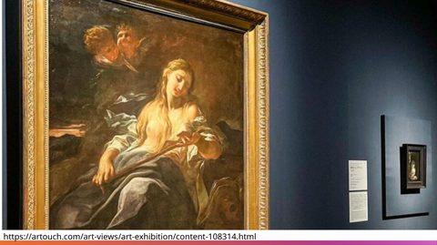](slides/slide-02.jpg)

- 預覽：[`slides/slide-02.jpg`](slides/slide-02.jpg)
- 縮圖：[`thumbs/slide-02.jpg`](thumbs/slide-02.jpg)

### Slide 03 — 靈感：poetry.camera

[](slides/slide-03.jpg)

- 預覽：[`slides/slide-03.jpg`](slides/slide-03.jpg)
- 縮圖：[`thumbs/slide-03.jpg`](thumbs/slide-03.jpg)

### Slide 04 — 專案概念／示意

[](slides/slide-04.jpg)

- 預覽：[`slides/slide-04.jpg`](slides/slide-04.jpg)
- 縮圖：[`thumbs/slide-04.jpg`](thumbs/slide-04.jpg)

### Slide 05 — 開源參考 poetry-camera-rpi (1)

[](slides/slide-05.jpg)

- 預覽：[`slides/slide-05.jpg`](slides/slide-05.jpg)
- 縮圖：[`thumbs/slide-05.jpg`](thumbs/slide-05.jpg)

### Slide 06 — 開源參考 poetry-camera-rpi (2)

[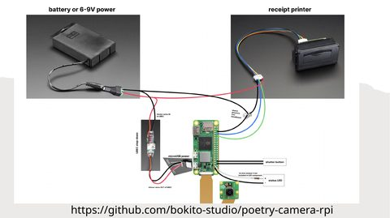](slides/slide-06.jpg)

- 預覽：[`slides/slide-06.jpg`](slides/slide-06.jpg)
- 縮圖：[`thumbs/slide-06.jpg`](thumbs/slide-06.jpg)

### Slide 07 — Teachable Machine 訓練

[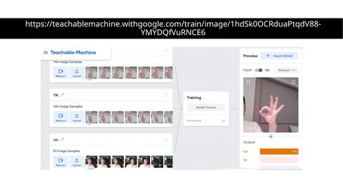](slides/slide-07.jpg)

- 預覽：[`slides/slide-07.jpg`](slides/slide-07.jpg)
- 縮圖：[`thumbs/slide-07.jpg`](thumbs/slide-07.jpg)

### Slide 08 — TM 超參數（Epochs / Batch / LR）

[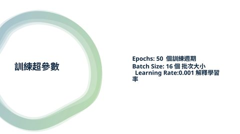](slides/slide-08.jpg)

- 預覽：[`slides/slide-08.jpg`](slides/slide-08.jpg)
- 縮圖：[`thumbs/slide-08.jpg`](thumbs/slide-08.jpg)

### Slide 09 — 調校與評估模型

[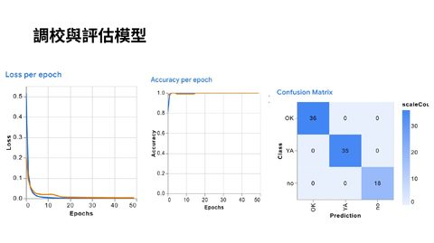](slides/slide-09.jpg)

- 預覽：[`slides/slide-09.jpg`](slides/slide-09.jpg)
- 縮圖：[`thumbs/slide-09.jpg`](thumbs/slide-09.jpg)

### Slide 10 — MediaPipe Gesture Recognizer

[](slides/slide-10.jpg)

- 預覽：[`slides/slide-10.jpg`](slides/slide-10.jpg)
- 縮圖：[`thumbs/slide-10.jpg`](thumbs/slide-10.jpg)

### Slide 11 — 硬體：樹莓派 Pi5 + Camera 3

[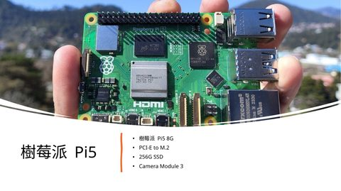](slides/slide-11.jpg)

- 預覽：[`slides/slide-11.jpg`](slides/slide-11.jpg)
- 縮圖：[`thumbs/slide-11.jpg`](thumbs/slide-11.jpg)

### Slide 12 — 硬體：EM5820 熱敏印表機

[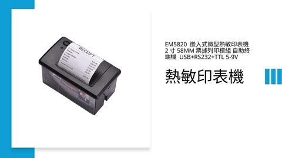](slides/slide-12.jpg)

- 預覽：[`slides/slide-12.jpg`](slides/slide-12.jpg)
- 縮圖：[`thumbs/slide-12.jpg`](thumbs/slide-12.jpg)

### Slide 13 — 應用場景：雙北世壯運／鐵人三項

[](slides/slide-13.jpg)

- 預覽：[`slides/slide-13.jpg`](slides/slide-13.jpg)
- 縮圖：[`thumbs/slide-13.jpg`](thumbs/slide-13.jpg)

### Slide 14 — 生成詩範例（世壯運）

[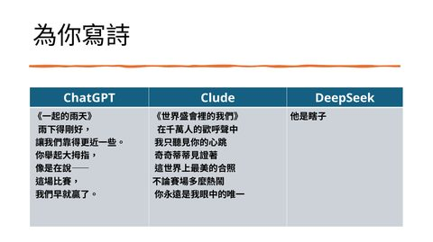](slides/slide-14.jpg)

- 預覽：[`slides/slide-14.jpg`](slides/slide-14.jpg)
- 縮圖：[`thumbs/slide-14.jpg`](thumbs/slide-14.jpg)

### Slide 15 — Prompt：ChatGPT 影像描述

[](slides/slide-15.jpg)

- 預覽：[`slides/slide-15.jpg`](slides/slide-15.jpg)
- 縮圖：[`thumbs/slide-15.jpg`](thumbs/slide-15.jpg)

### Slide 16 — Prompt：DeepSeek 寫詩

[](slides/slide-16.jpg)

- 預覽：[`slides/slide-16.jpg`](slides/slide-16.jpg)
- 縮圖：[`thumbs/slide-16.jpg`](thumbs/slide-16.jpg)

### Slide 17 — ChatGPT 描述輸出範例

[](slides/slide-17.jpg)

- 預覽：[`slides/slide-17.jpg`](slides/slide-17.jpg)
- 縮圖：[`thumbs/slide-17.jpg`](thumbs/slide-17.jpg)

### Slide 18 — DeepSeek 詩作《雨中獎盃》

[](slides/slide-18.jpg)

- 預覽：[`slides/slide-18.jpg`](slides/slide-18.jpg)
- 縮圖：[`thumbs/slide-18.jpg`](thumbs/slide-18.jpg)

### Slide 19 — 機殼：MakerWorld / Polaroid 風

[](slides/slide-19.jpg)

- 預覽：[`slides/slide-19.jpg`](slides/slide-19.jpg)
- 縮圖：[`thumbs/slide-19.jpg`](thumbs/slide-19.jpg)

### Slide 20 — 實體成品照片 (1)

[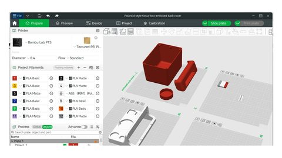](slides/slide-20.jpg)

- 預覽：[`slides/slide-20.jpg`](slides/slide-20.jpg)
- 縮圖：[`thumbs/slide-20.jpg`](thumbs/slide-20.jpg)

### Slide 21 — 實體成品照片 (2)

[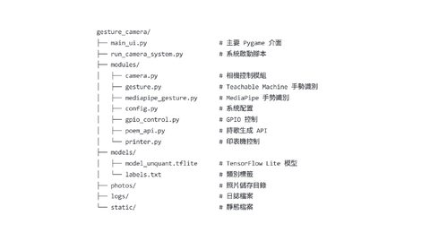](slides/slide-21.jpg)

- 預覽：[`slides/slide-21.jpg`](slides/slide-21.jpg)
- 縮圖：[`thumbs/slide-21.jpg`](thumbs/slide-21.jpg)

### Slide 22 — 實體成品照片 (3)

[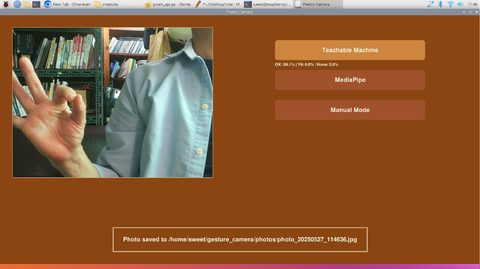](slides/slide-22.jpg)

- 預覽：[`slides/slide-22.jpg`](slides/slide-22.jpg)
- 縮圖：[`thumbs/slide-22.jpg`](thumbs/slide-22.jpg)

### Slide 23 — 實體成品照片 (4)

[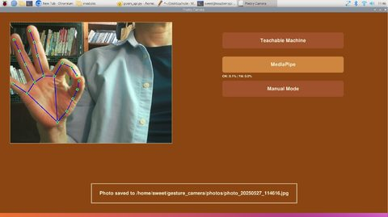](slides/slide-23.jpg)

- 預覽：[`slides/slide-23.jpg`](slides/slide-23.jpg)
- 縮圖：[`thumbs/slide-23.jpg`](thumbs/slide-23.jpg)

### Slide 24 — 實體成品照片 (5)

[](slides/slide-24.jpg)

- 預覽：[`slides/slide-24.jpg`](slides/slide-24.jpg)
- 縮圖：[`thumbs/slide-24.jpg`](thumbs/slide-24.jpg)

### Slide 25 — 實體成品照片 (6)

[](slides/slide-25.jpg)

- 預覽：[`slides/slide-25.jpg`](slides/slide-25.jpg)
- 縮圖：[`thumbs/slide-25.jpg`](thumbs/slide-25.jpg)

## 建議常用頁

| 用途 | 建議頁 |
|------|--------|
| 硬體展示 | 11, 12 |
| AI 管線 / Prompt | 15, 16, 17, 18 |
| 應用故事（世壯運） | 13, 14 |
| 成品外觀 | 19–25 |
| 開源脈絡 | 3, 5, 6 |

